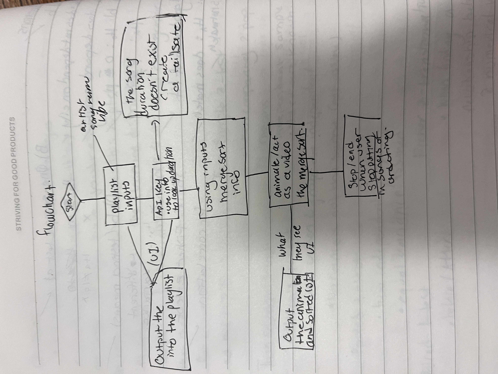
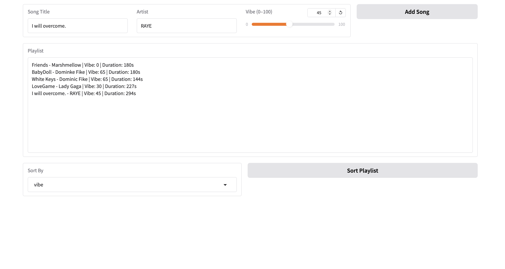
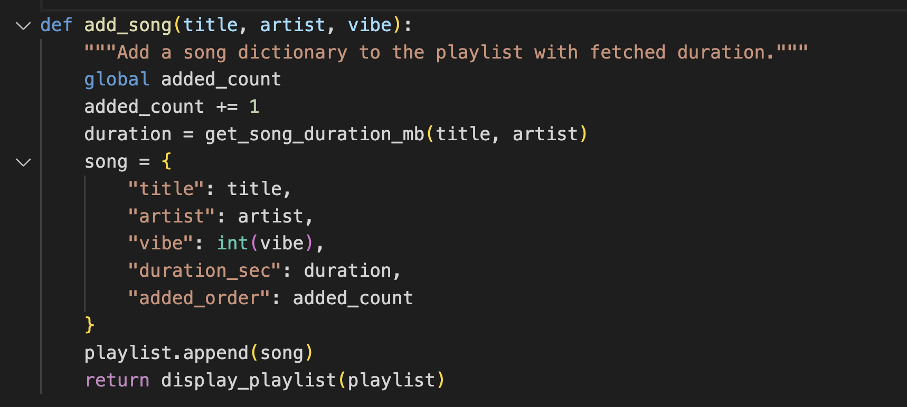
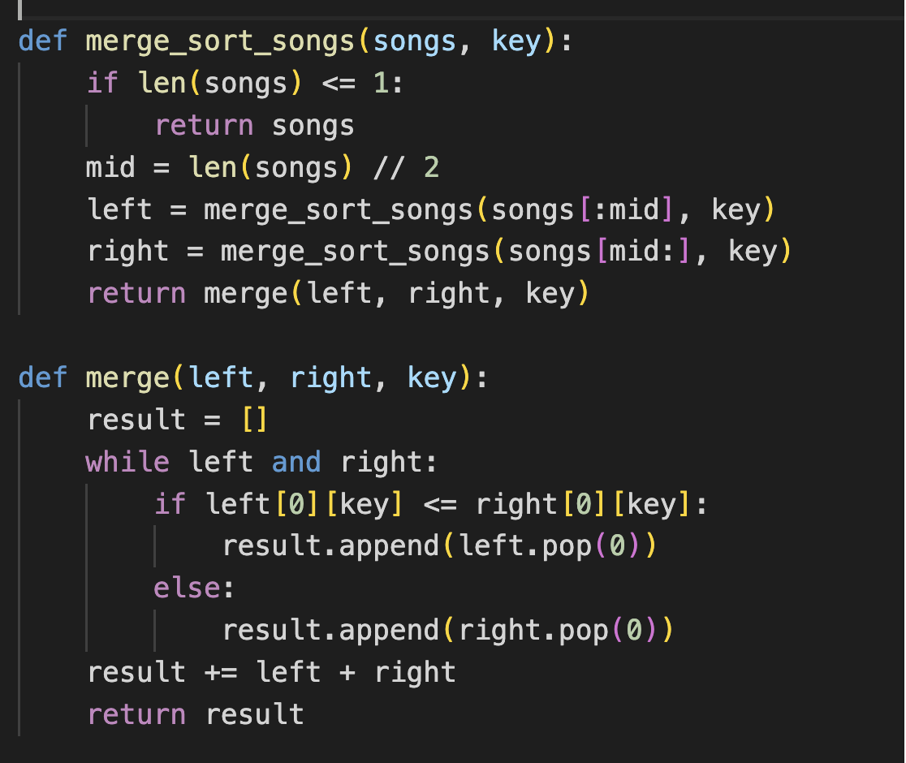
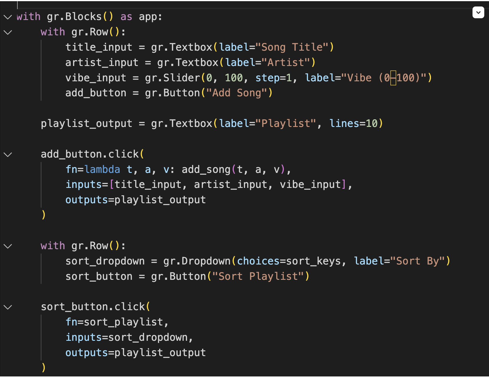
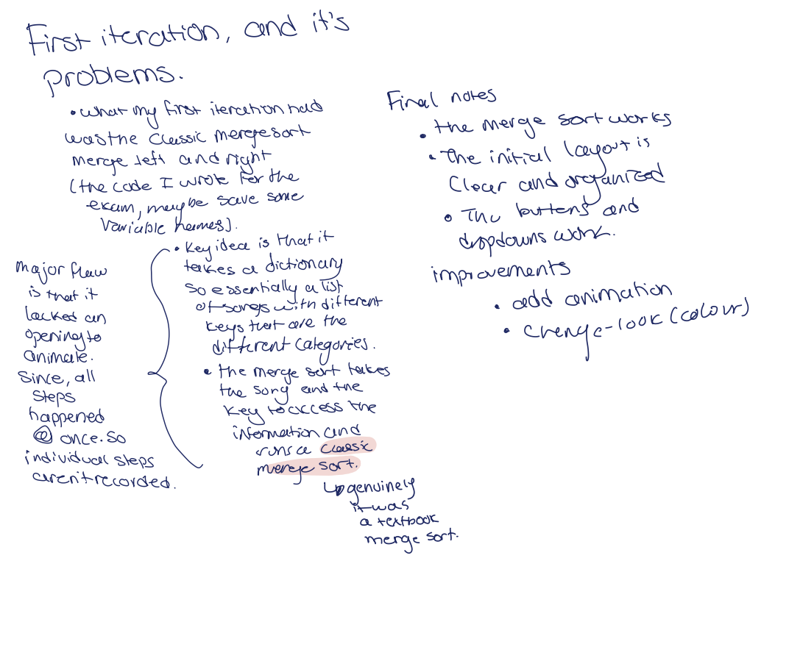
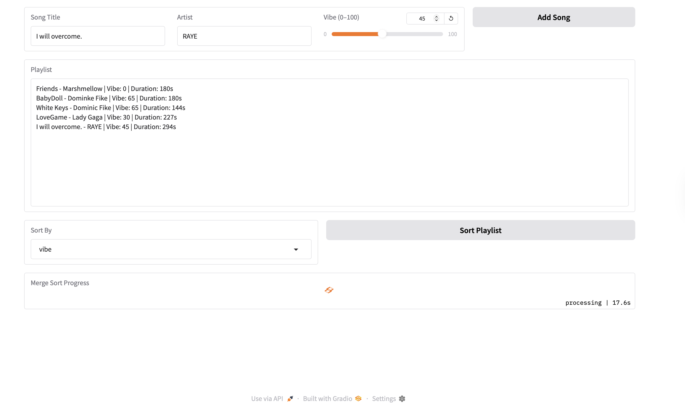
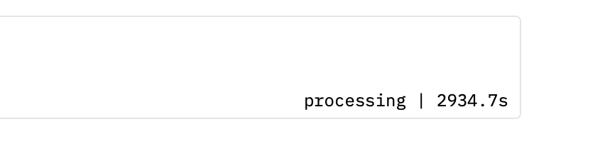
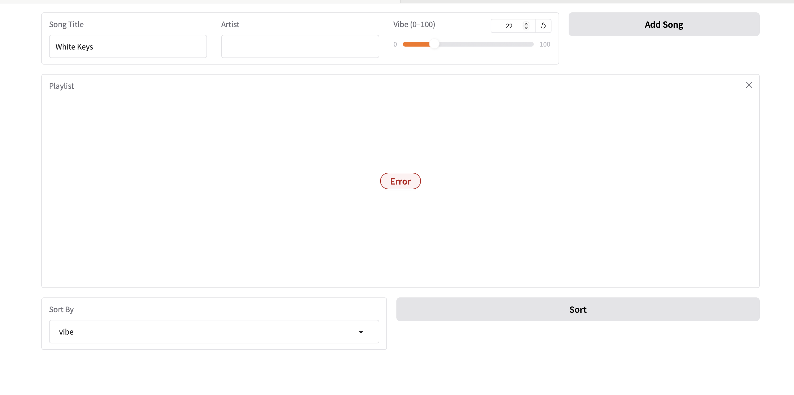
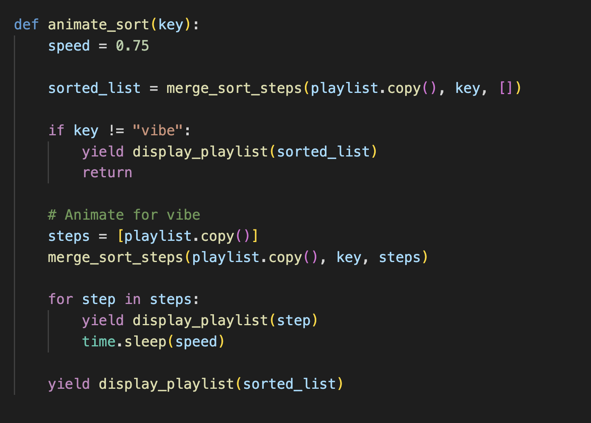

# Algorithm Name
The problem I chose is: **Playlist Vibe Builder.**
 
I chose the **merge sort** algorithm because it has a time complexity of O(n log n) in both the best and worst cases. Because the time complexity is the same regardless of playlist length, it's best for a playlist vibe maker. It allows people to create a playlist with hundreds of songs. Another thing to note is that merge sort is more stable than quicksort, which is good for a playlist. Stability is important because it preserves the original order of items with equal values, keeping the playlist consistent and predictable. This ensures that when songs share the same vibe, they remain in the order the user added them, maintaining the user’s intended experience. Although I understand it takes extra memory, I believe the efficiency of playlist ordering is more important.

There is literally no need for anything needed before the ordering. A user can not put an artist down, nor put down a name of a song (why, I don't know why, it is a playlist maker), nor put a vibe, etc...
I built the code with a bunch of fail-safes, so for example, when a user doesn't enter the name of a song or an artist, it's treated as an empty string and put at the top of the list. If the song they put in isn't part of the API data (I used MusicBrainz, simply because it's free and doesn't require tokens), it automatically sets the song's duration to 180 seconds. These are just there so the program does not crash if a user forgets 

What the user will see during the simulation: A Spotify-like layout. (Enter in *planned drawing*)
I was inspired by the popular music app Spotify, which has a long list of songs laid out for you to scroll through. Then I made it so that the user enters the information at the top and, logically, the page will scroll to the bottom to decide how to order the data. 


## Demo video/gif/screenshot of test

<video controls autoplay muted loop style="max-width: 100%;">
  <source src="https://huggingface.co/spaces/C-levison/Playlist_sorter/resolve/main/computingDemo.mp4" type="video/mp4">
</video>

If the demo video isn't working, here's a Google Drive link: https://drive.google.com/file/d/1faV_ENBYa3F5sIlioH2h2L4pchRjyPlL/view?usp=sharing
and the video is attached under Images.

## Problem Breakdown & Computational Thinking

### Step 2 — Plan Using Computational Thinking


**Decomposition**: This problem can be broken down into several parts: merge sort, inputs, user interface, additional interactivity, and API fetching. Then you can break down these subcategories further, like merge sort can be broken down into taking the input, the recursive part, and splitting it on either side. The inputs can be broken down into the number of inputs, the song name, the artist's name, and the vibe. The user interface can be broken down into essentials such as the playlist itself, the place to enter information, and the way to choose how to sort it. There is also 

**Pattern Recognition**: The algorithm follows a repeating pattern of dividing, comparing, and merging elements. The playlist is continuously split into smaller sublists until individual songs remain. These are then compared based on their “vibe” values and merged back together in sorted order. Instead of swapping elements, the algorithm builds a new ordered list step by step, consistently selecting the smaller value during each comparison.

**Abstraction**: One detail intentionally hidden from the user is the song’s duration, which the program retrieves automatically using an API key. This type of background process is handled entirely by the system and does not need to be shown, as it does not help the user understand how the algorithm works. Instead, the user is shown only the key steps of the sorting process, such as how the playlist is divided, which songs are compared based on their vibe values, and how the lists are merged. These steps are displayed visually through the GUI to make the algorithm easy to follow. By discarding technical details such as API requests, duration retrieval, and internal variables, the system keeps the focus on the algorithm's core logic, improving clarity and user understanding.

**Algorithm Design**:
The program takes a playlist as input, represented as a list of dictionaries containing song attributes such as title, artist, and vibe. It then processes this data by first retrieving additional information via an API (hidden from the user) and applying merge sort based on vibe, duration, and added order. Side note: the added order follows a slightly different processing path than vibe or duration, which either pulls from the API key or requires user input. The order added has a tally, which essentially just adds a number to the tally and assigns that value to the count in the dictionary. During execution, intermediate steps are captured to create an animation of the sorting process. The output is both a visually animated sequence showing how the algorithm works and a final playlist.

Flowchart for the code: 


## Steps to Run


This is the User interface I made from the start. The goal was to keep it as simple as possible. The input boxes tell you what to put, the song title and the artist. The add song button will add the song. Below the playlist box is the Sort By box, a dropdown that lets you choose how to sort the playlist. You pick how you want to sort the playlist, then press the sort playlist button to sort it. And if it uses the merge sort, then it animates it. 
- Since there were very few changes to the UI, I decided to only show the final result. 

# Evolution of the code throughout each iteration: 

**first iteration**

Note I only included specific parts, such as the User interface code, the merge sort and the initial dictionaries. 





Before discussing the program itself, I should note that I did not have the foresight to capture a screenshot of the API retrieval code. However, I can still explain my approach. I have prior experience working with API keys (for example, in a previous GitHub project where I used a NASA API for data analysis), so implementing this functionality required minimal additional research.

I chose to incorporate an API because I wanted the program to automatically retrieve song information, specifically duration, based only on the title and artist, without requiring extra inputs from the user. Initially, I considered using the Spotify API because it provided extensive music data. However, Spotify’s API access is either paid or temporary, with tokens expiring quickly. This would make the project difficult to test consistently and inconvenient for a TA to evaluate.

As a result, I explored alternative options and discovered MusicBrainz (see Author and AI acknowledgement below). Their documentation clearly outlines how to access and use their data, which made implementation straightforward. I primarily followed their guidelines while drawing on my prior experience with APIs.

As for the code itself, screenshotted, I broke down what worked in this iteration and what needed to change on my iPad, so I'll attach my notes below. 





**second iteration**
(I only showed the important parts of the code I truly changed)

```
def merge_steps(left, right, key, steps):
    result = []
    left = left.copy()
    right = right.copy()

    while left and right:
        if left[0][key] <= right[0][key]:
            result.append(left.pop(0))
        else:
            result.append(right.pop(0))

        # Save intermediate step
        steps.append(result + left + right)

    result += left + right

    # Save final merge
    steps.append(result.copy())

    return result
```
```
def generate_sort_steps(key):
    steps = []

    # Initial unsorted state
    steps.append(playlist.copy())

    merge_sort_songs_steps(playlist.copy(), key, steps)

    return steps
```

```
def start_sort(key):
    steps = generate_sort_steps(key)

    return (
        display_playlist(steps[0]),
        steps,
        gr.update(maximum=len(steps) - 1, value=0, visible=True)
    )

def update_step(step_index, steps):
    step_index = int(step_index)
    return display_playlist(steps[step_index])
```

This iteration failed remarkably. Here are some notes I have from the very moment it failed: My attempts at animating the code failed, it was loading, not showing anything, and nothing would sort itself. 



This shows that the playlist would create steps below the initial playlist list, not organize it and then load forever attempting to animate it.



Just to show you how long I let it run, until I gave up. 

Once again, I broke down what went wrong and right and how I should change it for the next step. 


**Third iteration:** Once again, I only included the noteworthy changes 
```
MAX_STEPS = 900

def merge_sort_steps(arr, key, steps):
    if len(arr) <= 1:
        return arr

    mid = len(arr) // 2
    left = merge_sort_steps(arr[:mid], key, steps)
    right = merge_sort_steps(arr[mid:], key, steps)

    return merge(left, right, key, steps)


def merge(left, right, key, steps):
    result = []
    i = j = 0

    while i < len(left) and j < len(right):
        if left[i][key] <= right[j][key]:
            result.append(left[i])
            i += 1
        else:
            result.append(right[j])
            j += 1

        # Save step (LIMITED)
        if len(steps) < MAX_STEPS:
            steps.append(result + left[i:] + right[j:])

    result.extend(left[i:])
    result.extend(right[j:])

    if len(steps) < MAX_STEPS:
        steps.append(result.copy())

    return result
```
(Change merge sort to accommodate my new idea, and create Max steps to ensure it wouldn't load forever. Worst case, you have to click merge again (realize it's a problem, but I can't come up with a more creative solution to stop the program from running too long). 

```
def animate_sort(key, speed):
    # If not vibe, there is no animation
    if key != "vibe":
        sorted_list = merge_sort_steps(playlist.copy(), key, [])
        yield display_playlist(sorted_list)
        return

    steps = [playlist.copy()]
    merge_sort_steps(playlist.copy(), key, steps)

    # Play like a video
    for step in steps:
        yield display_playlist(step)
        time.sleep(speed)
```
I decided to focus on animating only the vibe first. I would deal with the other 2 later (decomposition)!
What went well? The animation worked! Although it did use a slider to adjust the speed (I have no screenshots of this, sorry). But I found the user interface too complicated; I wanted the simplest thing possible, so I needed to find a way to make the speed a single value. Also, now every single other sorting method does not work. 



Here I had tried to organize it by artist name, quite literally threw ERROR and then jumped back to vibe on the dropdown. 

**The final iteration or iteration 4**

Major changes we're literally the animate function. 


- I set the speed to set time (simplifying UI) and essentially reminded it of other things required sorting too. 

Then I changed the same function (minor change that could honestly be called iteration 4), I basically allowed it to animate everything, so now everything being sorted has an animation. 

```
def animate_sort(key):
    speed = 0.75

    steps = [playlist.copy()]
    sorted_list = merge_sort_steps(playlist.copy(), key, steps)

    for step in steps:
        yield display_playlist(step)
        time.sleep(speed)

    yield display_playlist(sorted_list)
```

**Conclusion**
Of course, many smaller issues arose along the way, such as syntax errors, accidentally undefined variables, and minor off-by-one mistakes. However, documenting every single problem would be excessive. Instead, I chose to focus on major iterations of the program, highlighting how the code evolved, the key challenges I encountered, and how I resolved them. 

## Hugging Face Link
(https://huggingface.co/spaces/C-levison/Playlist_sorter)

## Author & AI Acknowledgment
API key musicBrainz: https://musicbrainz.org/doc/MusicBrainz_API
I used both to find where I needed to fetch the key and also how to use it (they explain it very well on their site). If you click under Python in libraries, it brings you to Python-specific info: 
https://python-musicbrainzngs.readthedocs.io/en/v0.7.1/

I used AI to crash-course myself on Gradio, as well as YouTube videos to understand how it worked. 

Link to AI chats: https://copilot.microsoft.com/shares/oxEZyuARX7ryC4CknQtYu

Second AI chat: https://copilot.microsoft.com/shares/DcnRNHbgvg2ezM3i31bY4

I used Microsoft Co-Pilot and Gemini, since they are the easiest to share links to the chats with. I mostly used AI to better understand Gradio, since I had never used it before. I used to help further understand what I covered in the YouTube videos (linked below). As well as how to add my own personal touch to the user interface. Then I also used to help me troubleshoot some problems I was havign with the whole hugging face syntax. 

The second AI chat is to figure out how to change the colour and font of something in Gradio, since the YouTube videos didn't cover that. 

YouTube video Link: https://www.youtube.com/watch?v=mB68GanHJj4&list=PLMi6KgK4_mk3DH0Mze62_wyxEmg4R9dF9

I used his Python Gradio tutorials 1-7, which showed me how to build basic components like dropdowns, text boxes, and sliders.

I also now use Gemini to help get this code to run on Hugging Face: https://gemini.google.com/share/e049309c7532 

I used Gemini to fix the onslaught of errors from Hugging Face, including configuration errors, important errors and undefined names. 
